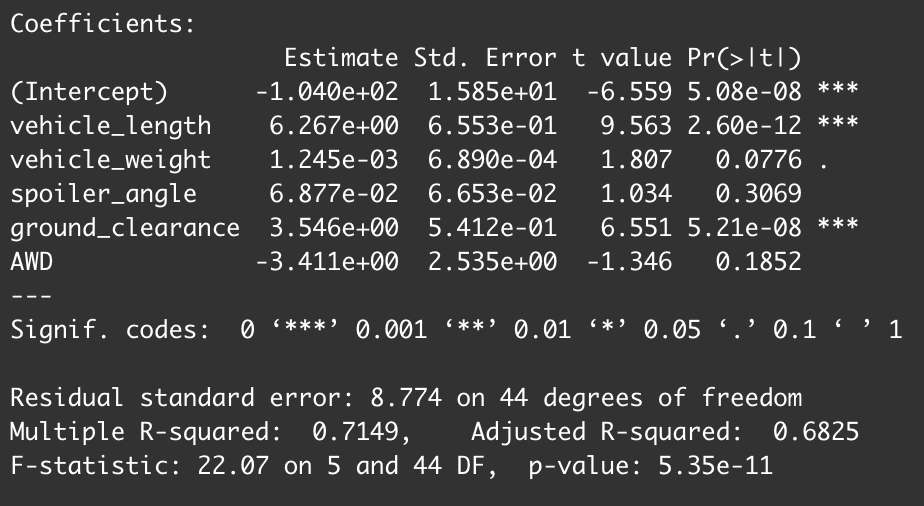
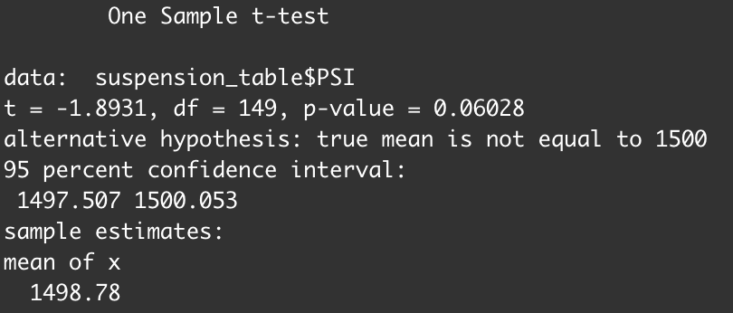
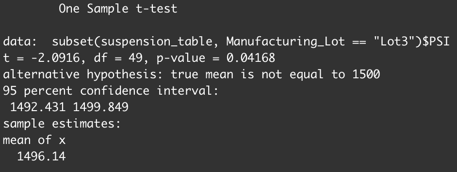

# mechaCar_statistical_analysis
## Project Overview
Given production data about a struggling new division, we are tasked with analyzing the data to help the manufacturing team improve their process. We will use R and statistical analysis to show which variables are most important when it comes to MPG of the prototype cars, and determine if different production lots are statistically different from the overall population.

## Resources
Data Sources: MechaCar_mpg.csv, Suspension_Coil.csv
Software Used: R Studio 2021.09.0 Build 351, Visual Studio Code 1.60.2

## Linear Regression to Predict MPG
* The variables that contributed a non random amount of variance, that is they were statistically significant in increasing MPG, were vehicle length and ground clearance. These variables had Pr(>|t|) values of 2.60e -12 and 5.21e -8 respectively, which shows the very low contribution to the overall variance by these two variables.
* The slope of the model would be positive and greater than zero  after reviewing the summary statistics of our regression model. The vehicle length and ground clearance coefficients are 6.27 and 3.55 respectively, indicating a positive and nonzero slope.
* The regression model is fairly reliable in predicting MPG, as our R-squared and Adjusted R-Squared values are .71 and .68 respectively. This indicates that ~68% of MPG variation can be explained by our model containing all variables that we used.

## Summary Statistics on Suspension Coils
* The manufacturing standards state that the variance in each suspension cannot be greater than 100 PSI. Overall, as we can see in the image below, the measured suspensions meet these standards and have a variance of 62.3 PSI. 

* However, when we break down the data by lot we find something interesting. Something in Lot 3 was the main contributor to the overall variance. There was basically no variance in Lots 1 and 2, indicating sound manufacturing process, but in Lot 3 the variance was 170.3, indicating something gone wrong in that same manufacturing process.

## T-Tests on Suspension Coils
* When running a one sample T-test on our sample mean vs the population mean of 1500 PSI, we get a p-value of 0.06. This is above our 0.05 alpha and indicates that we cannot reject the null hypothesis and that the two means are statistically similar

* We ran the same analysis (a one sample t-test) but this time comparing each lot individually to the given population mean of 1500 PSI. In this analysis we found that the p-values in both Lot 1 and Lot 2 were greater than our alpha and therefore with the given evidence we cannot reject the null hypothesis and can determine that the mean of each lot is similar to the population mean. The p-value for lot one was 1.0, as the mean was 1500 for both the sample and overall population, and for Lot 2 the p-value was .60.

* For Lot 3 however, our p-value was 0.04, which is below our alpha. Therefore we can reject the null hypothesis and determine that there is a statistically significant difference between the mean of Lot 3 and the population mean. With this information, we know that we need to focus in on Lot 3 to determine what if anything changed in the manufacturing process to lead to this difference.

## Study Design: MechaCar vs Competition
* There are many factors that go into a consumers decision to purchase a vehicle, and in order to best position the MechaCar in the market, we need to identify where and how it stacks up against our competitors.
* Our target demographic values speed and acceleration very highly when making decisions, and that is where we want to see where the MechaCar stacks up. We will analyze the MechaCar's acceleration by looking at the time it takes to go from 0-60mph, as well as the MechaCar's top speed, and compare these to our competitors averages in those categories. 
* Our alternative hypothesis in this scenario would be that there is a statistically significant difference between the MechaCar in those two metrics compared to our competitors.
* By running two seperate t-tests for acceleration and speed compared to our competitors, we will be able to see if our product is in line with the competition, beats them, or falls behind.
* We would need the 0-60 times and top speeds for a number of production MechaCars, to have a large enough sample. We would also need the overall mean in each metric in our production caategory (ie Sports Car, or Sedan).